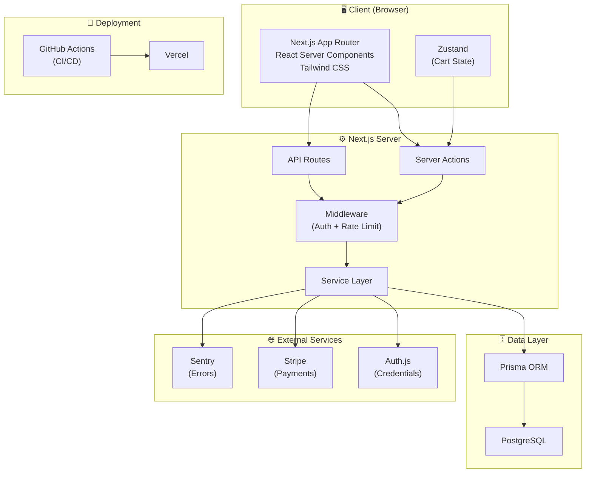

# 🧠 Ebazaar — System Architecture & Implementation Plan

> **Planner Agent Output** — Production-grade e-commerce platform

---

## 1. System Architecture Overview



### Data Flow

```
User Action → React Component → Server Action / API Route
    → Middleware (auth check, rate limit)
    → Service Layer (business logic)
    → Prisma ORM → PostgreSQL
    → Response → UI Update
```

**Payment Flow:**
```
Cart → Stripe Checkout Session → Stripe Hosted Page → Webhook
    → Verify Signature → Create Order → Update Stock → Email
```

---

## 2. Module Breakdown

| Module | Owner | Key Files | Dependencies |
|:-------|:------|:----------|:-------------|
| **Auth** | Implementer | `src/lib/auth.ts`, `src/app/(auth)/` | Auth.js, Prisma |
| **Products** | Implementer | `src/app/(shop)/products/`, `src/services/product.ts` | Auth (admin) |
| **Cart** | Implementer | `src/stores/cart.ts`, `src/services/cart.ts` | Auth, Products |
| **Checkout** | Implementer | `src/app/checkout/`, `src/lib/stripe.ts` | Cart, Stripe |
| **Orders** | Implementer | `src/app/orders/`, `src/services/order.ts` | Checkout, Auth |
| **Admin** | Implementer | `src/app/admin/` | Auth (role=ADMIN) |
| **CI/CD** | DevOps | `.github/workflows/`, `vercel.json` | All |
| **Tests** | QA | `tests/`, `e2e/` | All modules |

---

## 3. Database Schema (Prisma)

```prisma
model User {
  id            String    @id @default(cuid())
  name          String
  email         String    @unique
  passwordHash  String
  role          Role      @default(USER)
  cart          Cart?
  orders        Order[]
  reviews       Review[]
  createdAt     DateTime  @default(now())
  updatedAt     DateTime  @updatedAt
}

enum Role { USER ADMIN }

model Category {
  id        String    @id @default(cuid())
  name      String    @unique
  slug      String    @unique
  products  Product[]
}

model Product {
  id          String      @id @default(cuid())
  name        String
  slug        String      @unique
  description String
  price       Decimal     @db.Decimal(10,2)
  images      String[]
  stock       Int         @default(0)
  featured    Boolean     @default(false)
  categoryId  String
  category    Category    @relation(fields: [categoryId], references: [id])
  cartItems   CartItem[]
  orderItems  OrderItem[]
  reviews     Review[]
  createdAt   DateTime    @default(now())
  updatedAt   DateTime    @updatedAt
}

model Cart {
  id        String     @id @default(cuid())
  userId    String     @unique
  user      User       @relation(fields: [userId], references: [id])
  items     CartItem[]
  updatedAt DateTime   @updatedAt
}

model CartItem {
  id        String  @id @default(cuid())
  cartId    String
  cart      Cart    @relation(fields: [cartId], references: [id], onDelete: Cascade)
  productId String
  product   Product @relation(fields: [productId], references: [id])
  quantity  Int     @default(1)
  @@unique([cartId, productId])
}

model Order {
  id              String      @id @default(cuid())
  userId          String
  user            User        @relation(fields: [userId], references: [id])
  status          OrderStatus @default(PENDING)
  total           Decimal     @db.Decimal(10,2)
  stripeSessionId String?     @unique
  items           OrderItem[]
  shippingAddress Json?
  createdAt       DateTime    @default(now())
  updatedAt       DateTime    @updatedAt
}

enum OrderStatus { PENDING PAID SHIPPED DELIVERED CANCELLED }

model OrderItem {
  id        String  @id @default(cuid())
  orderId   String
  order     Order   @relation(fields: [orderId], references: [id], onDelete: Cascade)
  productId String
  product   Product @relation(fields: [productId], references: [id])
  quantity  Int
  price     Decimal @db.Decimal(10,2)
}

model Review {
  id        String   @id @default(cuid())
  rating    Int
  comment   String?
  userId    String
  user      User     @relation(fields: [userId], references: [id])
  productId String
  product   Product  @relation(fields: [productId], references: [id])
  createdAt DateTime @default(now())
  @@unique([userId, productId])
}
```

---

## 4. Folder Structure

```
ebazaar/
├── .github/workflows/ci.yml
├── prisma/
│   ├── schema.prisma
│   ├── migrations/
│   └── seed.ts
├── src/
│   ├── app/
│   │   ├── layout.tsx              # Root layout
│   │   ├── page.tsx                # Home / landing
│   │   ├── globals.css
│   │   ├── (auth)/
│   │   │   ├── sign-in/page.tsx
│   │   │   └── sign-up/page.tsx
│   │   ├── (shop)/
│   │   │   ├── products/page.tsx          # Listing
│   │   │   └── products/[slug]/page.tsx   # Detail
│   │   ├── cart/page.tsx
│   │   ├── checkout/
│   │   │   ├── page.tsx
│   │   │   └── success/page.tsx
│   │   ├── orders/page.tsx
│   │   ├── admin/
│   │   │   ├── layout.tsx
│   │   │   ├── page.tsx           # Dashboard
│   │   │   ├── products/page.tsx
│   │   │   └── orders/page.tsx
│   │   └── api/
│   │       └── webhooks/stripe/route.ts
│   ├── components/
│   │   ├── ui/                    # Primitives (Button, Input, Card…)
│   │   ├── layout/                # Header, Footer, Sidebar
│   │   ├── products/              # ProductCard, ProductGrid…
│   │   ├── cart/                   # CartItem, CartSummary…
│   │   └── admin/                 # AdminNav, DataTable…
│   ├── lib/
│   │   ├── auth.ts                # Auth.js config
│   │   ├── prisma.ts              # Prisma client singleton
│   │   ├── stripe.ts              # Stripe client
│   │   ├── utils.ts               # Helpers
│   │   └── validators.ts          # Zod schemas
│   ├── services/
│   │   ├── user.ts
│   │   ├── product.ts
│   │   ├── cart.ts
│   │   ├── order.ts
│   │   └── review.ts
│   ├── actions/                   # Server Actions
│   │   ├── auth.ts
│   │   ├── product.ts
│   │   ├── cart.ts
│   │   ├── order.ts
│   │   └── admin.ts
│   ├── stores/
│   │   └── cart.ts                # Zustand store
│   ├── types/
│   │   └── index.ts
│   └── middleware.ts
├── tests/
│   ├── unit/
│   │   ├── services/
│   │   └── utils/
│   └── integration/
│       └── api/
├── e2e/
│   ├── auth.spec.ts
│   ├── products.spec.ts
│   ├── cart.spec.ts
│   └── checkout.spec.ts
├── .env.example
├── next.config.ts
├── tailwind.config.ts
├── tsconfig.json
├── playwright.config.ts
├── vitest.config.ts
└── package.json
```

---

## 5. Task Backlog

### Phase 1: Project Setup

| # | Task | Files | Depends On | Effort |
|:--|:-----|:------|:-----------|:-------|
| 1.1 | Init Next.js 16 + TypeScript | `package.json`, `tsconfig.json`, `next.config.ts` | — | 0.5h |
| 1.2 | Configure Tailwind CSS | `tailwind.config.ts`, `globals.css` | 1.1 | 0.5h |
| 1.3 | Setup ESLint + Prettier | `.eslintrc.json`, `.prettierrc` | 1.1 | 0.25h |
| 1.4 | Create folder structure | `src/` tree | 1.1 | 0.25h |
| 1.5 | Setup Prisma + schema | `prisma/schema.prisma`, `src/lib/prisma.ts` | 1.1 | 1h |
| 1.6 | Create seed script | `prisma/seed.ts` | 1.5 | 1h |
| 1.7 | Create `.env.example` | `.env.example` | 1.5 | 0.25h |
| 1.8 | Setup Vitest + Playwright | `vitest.config.ts`, `playwright.config.ts` | 1.1 | 0.5h |

---

### Phase 2: Authentication

| # | Task | Files | Depends On | Effort |
|:--|:-----|:------|:-----------|:-------|
| 2.1 | Auth.js config | `src/lib/auth.ts`, `src/app/api/auth/[...nextauth]/route.ts` | 1.5 | 1h |
| 2.2 | Sign-up page + action | `src/app/(auth)/sign-up/`, `src/actions/auth.ts` | 2.1 | 1.5h |
| 2.3 | Sign-in page | `src/app/(auth)/sign-in/` | 2.1 | 1h |
| 2.4 | Middleware (protected routes) | `src/middleware.ts` | 2.1 | 0.5h |
| 2.5 | Role-based access helpers | `src/lib/auth.ts` | 2.1 | 0.5h |
| 2.6 | Auth unit tests | `tests/unit/services/auth.test.ts` | 2.1–2.5 | 1h |
| 2.7 | Auth E2E tests | `e2e/auth.spec.ts` | 2.2, 2.3 | 1h |

---

### Phase 3: Product System

| # | Task | Files | Depends On | Effort |
|:--|:-----|:------|:-----------|:-------|
| 3.1 | Product service layer | `src/services/product.ts` | 1.5 | 1h |
| 3.2 | Product listing page (SSR) | `src/app/(shop)/products/page.tsx` | 3.1 | 1.5h |
| 3.3 | Product detail page | `src/app/(shop)/products/[slug]/page.tsx` | 3.1 | 1h |
| 3.4 | Search + filter UI | `src/components/products/` | 3.2 | 1.5h |
| 3.5 | Admin product CRUD | `src/app/admin/products/`, `src/actions/product.ts` | 2.5, 3.1 | 2h |
| 3.6 | Category management | `src/services/product.ts`, admin UI | 3.5 | 1h |
| 3.7 | Product tests | `tests/`, `e2e/products.spec.ts` | 3.1–3.6 | 1.5h |

---

### Phase 4: Cart & Checkout

| # | Task | Files | Depends On | Effort |
|:--|:-----|:------|:-----------|:-------|
| 4.1 | Zustand cart store | `src/stores/cart.ts` | 1.1 | 0.5h |
| 4.2 | Cart service (DB sync) | `src/services/cart.ts`, `src/actions/cart.ts` | 1.5, 2.1 | 1.5h |
| 4.3 | Cart page UI | `src/app/cart/page.tsx`, `src/components/cart/` | 4.1, 4.2 | 1.5h |
| 4.4 | Stripe checkout session | `src/lib/stripe.ts`, `src/actions/order.ts` | 4.2 | 1.5h |
| 4.5 | Stripe webhook handler | `src/app/api/webhooks/stripe/route.ts` | 4.4 | 1.5h |
| 4.6 | Checkout success page | `src/app/checkout/success/page.tsx` | 4.4 | 0.5h |
| 4.7 | Cart + checkout tests | `tests/`, `e2e/cart.spec.ts`, `e2e/checkout.spec.ts` | 4.1–4.6 | 2h |

---

### Phase 5: Orders

| # | Task | Files | Depends On | Effort |
|:--|:-----|:------|:-----------|:-------|
| 5.1 | Order service | `src/services/order.ts` | 4.5 | 1h |
| 5.2 | User order history page | `src/app/orders/page.tsx` | 5.1 | 1h |
| 5.3 | Admin order management | `src/app/admin/orders/page.tsx`, `src/actions/admin.ts` | 5.1, 2.5 | 1.5h |
| 5.4 | Order status updates | `src/services/order.ts` | 5.3 | 0.5h |
| 5.5 | Order tests | `tests/`, `e2e/` | 5.1–5.4 | 1h |

---

### Phase 6: Deployment & Polish

| # | Task | Files | Depends On | Effort |
|:--|:-----|:------|:-----------|:-------|
| 6.1 | GitHub Actions CI | `.github/workflows/ci.yml` | 1.8 | 1h |
| 6.2 | Vercel config | `vercel.json` | 1.1 | 0.5h |
| 6.3 | Security headers + rate limiting | `next.config.ts`, `src/middleware.ts` | 2.4 | 1h |
| 6.4 | Sentry integration | `src/lib/sentry.ts`, `next.config.ts` | 1.1 | 0.5h |
| 6.5 | Performance audit | All pages | 6.1–6.4 | 1h |
| 6.6 | Deployment runbook | `docs/deployment.md` | 6.1, 6.2 | 0.5h |
| 6.7 | Final test suite run + coverage | `tests/`, `e2e/` | All | 1h |

---

## 6. Sprint Plan (7 Days)

| Day | Focus | Tasks | Agent |
|:----|:------|:------|:------|
| **1** | Setup + Schema | 1.1–1.8 | Implementer + DevOps |
| **2** | Authentication | 2.1–2.5 | Implementer |
| **3** | Auth tests + Products start | 2.6–2.7, 3.1–3.3 | QA + Implementer |
| **4** | Products complete + Admin | 3.4–3.7 | Implementer + QA |
| **5** | Cart & Checkout | 4.1–4.6 | Implementer |
| **6** | Orders + checkout tests | 4.7, 5.1–5.5 | Implementer + QA |
| **7** | Deploy + polish | 6.1–6.7 | DevOps + QA |

---

## 7. Git Strategy

| Item | Convention |
|:-----|:-----------|
| **Main branch** | `main` (production) |
| **Dev branch** | `develop` (integration) |
| **Feature branches** | `feat/<phase>-<feature>` e.g. `feat/auth-signup` |
| **Fix branches** | `fix/<description>` |
| **Commits** | Conventional: `feat:`, `fix:`, `test:`, `ci:`, `docs:` |
| **PRs** | Title = commit message, body = checklist, must pass CI |
| **Branch protection** | Require CI pass + 1 approval on `main` |

---

## 8. Acceptance Criteria

### Auth Module
- ✅ User can sign up with email/password
- ✅ User can sign in and receives session
- ✅ Unauthenticated users redirected to sign-in
- ✅ Admin-only routes return 403 for regular users

### Product Module
- ✅ Products render server-side with pagination
- ✅ Search returns relevant results within 200ms
- ✅ Admin can create/edit/delete products
- ✅ Product detail shows reviews and stock

### Cart & Checkout
- ✅ Cart persists across sessions (DB-backed)
- ✅ Stock validated before checkout
- ✅ Stripe checkout completes without errors
- ✅ Webhook creates order and clears cart

### Orders
- ✅ Users see only their own orders
- ✅ Admin can view all orders and update status
- ✅ Order total matches items × price

### Deployment
- ✅ CI passes lint + tests on every PR
- ✅ Preview deploys on PR, production on `main` merge
- ✅ No secrets in codebase
- ✅ Coverage ≥ 65% for core services

---

## User Review Required

> [!IMPORTANT]
> **This architecture must be approved before any code is written.** The Implementer, QA, and DevOps agents will not proceed until this plan is confirmed.

Key decisions requiring your input:

1. **Database**: Plan uses PostgreSQL. Do you have a hosted PostgreSQL instance (e.g., Neon, Supabase, Railway), or should we use SQLite for local dev?
2. **Stripe**: Do you have a Stripe test-mode API key, or should we stub payments initially?
3. **Auth.js**: Plan uses credentials (email/password). Want to add OAuth providers (Google, GitHub)?
4. **Scope**: This is an MVP-first approach. Anything you want added or removed?

---

## Verification Plan

### Automated Tests
- `npm run lint` — zero errors
- `npm run test` — all unit + integration tests pass
- `npx playwright test` — all E2E flows pass
- `npm run build` — production build succeeds

### Manual Verification
- Visual review of all pages in the browser
- Stripe test-mode payment completion
- Admin dashboard CRUD operations
- Mobile responsiveness check
